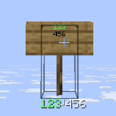

# SignLens

> A lightweight, zero-client world text accessibility layer for Paper.

[](https://github.com/la8garlic/SignLens/actions/workflows/ci.yml)

SignLens helps a player read Minecraft signs without changing the world, adding client mods, or taking ownership of sign interactions. It detects the sign under the player's view, waits until the player appears to be reading it, and presents the sign's content in an ActionBar.

## 0.1 scope

The first release is intentionally a passive reader:

- Paper 26.2 as the first supported server target.
- Java 25, as required by the Paper 26.1+ target line.
- Standing, wall, hanging, and wall-hanging signs.
- Front/back side selection through the Paper API.
- Adventure `Component` content with presentation formatting preserved.
- Multi-line signs preserve their line structure internally and use a visible
  `↵` line-break marker in the 0.1 ActionBar projection.
- Focus detection with dwell and lost-grace states.
- Edge-triggered ActionBar rendering; no per-tick ActionBar spam.
- Adaptive per-player ray tracing with an idle probe.
- Paper/Folia-compatible scheduling through player-owned `EntityScheduler` tasks.
- No NMS, ProtocolLib, resource pack, database, generated entity, block mutation, or sign interaction interception.

Exact multi-row Dialog/deep-reading gestures are explicitly deferred to 0.2.

## Installation

1. Run Paper 26.2 with Java 25.
2. Download `SignLens-0.1.0.jar` from the GitHub release, or build it locally.
3. Copy the JAR into the server's `plugins` directory and restart the server.

No client mod, ProtocolLib installation, resource pack, or database is required.
SignLens writes only its own `plugins/SignLens/config.yml` file and never edits
signs or other world state.

## Development

Requirements: Java 25 or newer and no separately installed Gradle is needed.

On Windows:

```powershell
./gradlew.bat clean build
```

On macOS/Linux:

```bash
./gradlew clean build
```

The plugin JAR is written to `build/libs/SignLens-0.1.0.jar`.

To preview the runtime on a local Paper 26.2 server, run
`./tools/run-paper-raytrace-integration.ps1 -KeepServer`; the temporary server
stays available on `localhost:25565` after the automated probe completes. The
PowerShell harnesses discover Java 25 from `JAVA_HOME` or `PATH`.

## Runtime flow

```text
Player EntityScheduler
        |
        v
  PlayerScanTask -- view changed? --> RayTraceSignDetector
        |                                  |
        |                                  v
        +--------------------------> FocusController
                                           |
                                  focused sign confirmed
                                           v
                                      SignReader
                                           v
                                      SignSnapshot
                                           v
                                 ContentFormatter
                                           v
                                   RenderPolicy
                                           v
                                  ActionBarRenderer
```

The dependency direction is deliberate:

```text
Detector -> FocusController -> SignReader -> Renderer
```

The detector does not read text or render. The renderer does not ray trace. The reader does not schedule tasks.

## Configuration baseline

```yaml
enabled: true

detection:
  max-distance: 8.0
  scan-period-ticks: 2
  position-threshold: 0.02
  rotation-threshold-degrees: 1.0

focus:
  dwell-millis: 200
  lost-grace-millis: 300

render:
  mode: action-bar
  soft-limit: 96
  max-length: 120
  keepalive-millis: 2500

performance:
  idle-probe-ticks: 10

debug:
  enabled: true
```

These defaults are the measured 0.1 baseline. Detection thresholds and timing
values are loaded at startup, validated, and applied to newly created player
sessions. Restart the server after changing the file; 0.1 intentionally has no
reload command. See [the performance evidence](docs/performance.md) for the
local Paper validation environment and limitations.

## Commands and permissions

```text
/signlens debug
```

```text
signlens.use                 (default: true)
signlens.command.debug       (default: op)
```

The debug command reports only the sender's current focus/session and local
performance counters. Per-player enable/disable preferences are deferred
because 0.1 does not persist player settings.

## Project status

The 0.1.0 implementation is feature-complete through Issue 11: detection,
focus, sign reading, formatting, ActionBar rendering, player sessions,
adaptive scans, ActionBar-safe line preservation, on-demand diagnostics, and
measured Paper performance validation. See:

- [Architecture](docs/architecture.md)
- [UX contract](docs/ux.md)
- [Performance plan](docs/performance.md)
- [Architecture decision records](docs/decisions/)
- [Issue series](docs/issues/)
- [Changelog](CHANGELOG.md)

## 0.1.0 release validation

The final release candidate was validated on Paper 26.2 build 112 with Java
25. The real integration probe passed all four sign shapes, both reading
boundaries, distance and non-sign cases, and the complete runtime pipeline.
The 20-client performance smoke test also passed with 1,000 scans, 400 ray
traces, 600 adaptive skips, and zero ActionBar sends in the miss-only run.

The final in-game preview confirms that a sign written as `123` followed by
`456` is presented in the native ActionBar as `123↵456`, without the former
replacement glyph:



The detailed measurements and reproducible commands are in
[docs/performance.md](docs/performance.md). The screenshot is the maintainer's
manual Paper validation evidence for the line-preservation acceptance case.

## Known limitations

- The native ActionBar is one row. Sign line boundaries are shown with `↵`;
  exact stacked rows are deferred to a future Dialog renderer.
- Paper's block ray tracing may load chunks. SignLens uses one short view ray
  and does not scan nearby blocks or maintain a global sign cache.
- 0.1 targets Paper 26.2 and Java 25 only. Other Minecraft/Paper versions are
  not part of this release contract.

## Non-negotiable invariants

1. The Minecraft world remains the source of truth.
2. SignLens never edits signs, blocks, PDC, metadata, or entities.
3. SignLens never intercepts or cancels ordinary sign interaction in 0.1.
4. Detection follows the player's view ray; it never scans nearby blocks.
5. ActionBar output is sent on focus/content transitions and an infrequent keepalive only when policy requires it.
6. A session owns state only; controllers own behavior.
7. No global sign cache is introduced before profiling demonstrates a need.

## References

- [Minecraft Java Edition 26.2](https://www.minecraft.net/en-us/article/minecraft-java-edition-26-2)
- [Supporting Paper and Folia](https://docs.papermc.io/paper/dev/folia-support/)
- [Paper Dialog API](https://docs.papermc.io/paper/dev/dialogs/)
- [Paper plugin configuration](https://docs.papermc.io/paper/dev/plugin-configurations/)
- [Paper commands](https://docs.papermc.io/paper/reference/commands/)
